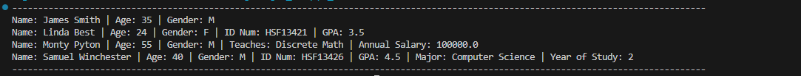

# Java - QAP 3

## Noah Whiffen - SD12 --- Started on March 10th, 2025 - Finished on ??

---

### Screenshots of program output

#### Exercise 1

#### Exercise 2

#### Exercise 3

#### Exercise 4

---

### Please see below my answers to the assessment questions.

- *How many hours did it take you to complete this assessment? (Please keep try to keep track of how many hours you have spent working on each individual part of this assessment as best you can - an estimation is fine; we just want a rough idea.)*

Problem 1 only took me about an hour and a half. Problem2 took me 2 hours. Problem 3 took 2 hours. Problem 4 took

- What online resources you have used? (My lectures, YouTube, Stack overflow etc.)

*answer here*

- Did you need to ask any of your friends in solving the problems. (If yes, please mention name of the friend. They must be amongst your class fellows.)

*answer here*

- Did you need to ask questions to any of your instructors? If so, how many questions did you ask (or how many help sessions did you require)?

*answer here*

- Rate (subjectively) the difficulty of each question from your own perspective, and whether you feel confident that you can solve a similar but different problem requiring some of the same techniques in the future now that you’ve completed this one.